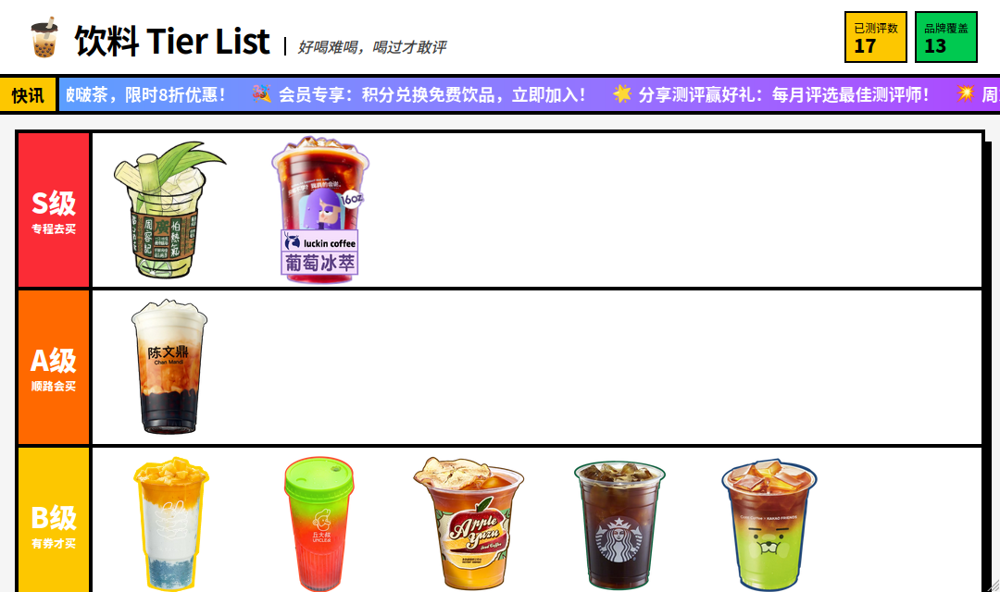

# 饮料测评图鉴 - 待办事项

## 资源准备
- [x] 收集所有饮料的高质量图片
- [x] 设计并添加网站品牌LOGO和favicon
- [x] 
- [ ] 录制或获取气泡爆破音效（pop.mp3）
- [ ] 准备更多饮料测评数据（至少30条）

## 性能优化
- [ ] 对饮料图片进行压缩（WebP格式）
- [ ] 代码分割优化

## 内容运营
- [ ] 每周更新3-5条新饮料测评
- [ ] 在社交媒体分享测评结果
